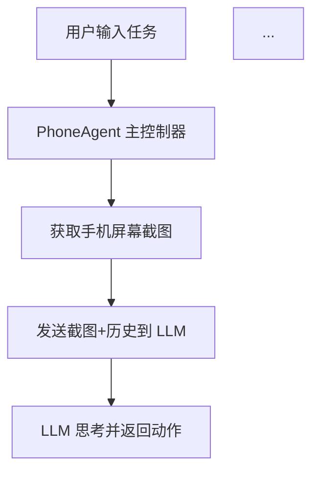

# 学习资源创建完成总结

## 📋 任务完成情况

根据您的需求，我已经为 Open-AutoGLM 项目创建了一套完整的学习资源体系。以下是详细说明：

---

## ✅ 已完成的工作

### 1. 📖 学习指南 (LEARNING_GUIDE.md)

**文件路径**: `docs/LEARNING_GUIDE.md`  
**文件大小**: 28KB / 1,174行  

**主要内容**:
- **项目概览**: 通俗易懂地介绍项目功能、技术栈、整体架构
- **核心概念**: 详细讲解 LLM、Agent 模式、多模态等关键概念
- **分阶段学习路径**:
  - 第一阶段 (1-2小时): 快速理解
  - 第二阶段 (3-4小时): 核心流程
  - 第三阶段 (2-3小时): 配置和扩展
  - 第四阶段: 深入研究（选学）
- **架构流程图**: 4个 Mermaid 流程图
  - 整体架构图
  - 任务执行流程
  - LLM 交互细节
  - 动作执行流程
- **Python 语法快速参考**
- **关键模块详解**
- **常见问题 FAQ**

**特色**:
- ✅ 面向 LLM 初学者
- ✅ 适合 Python 基础学习者
- ✅ 包含完整的可视化流程图
- ✅ 提供学习检查点

---

### 2. 🐍 Python 基础补充 (PYTHON_BASICS_SUPPLEMENT.md)

**文件路径**: `docs/PYTHON_BASICS_SUPPLEMENT.md`  
**文件大小**: 25KB / 1,230行  

**主要内容**:
- **基础语法对比** (C vs Python):
  - 变量声明和类型
  - 控制流 (if/for/while)
  - 函数定义
  - 指针 vs 引用
- **数据结构**:
  - List (列表) vs 动态数组
  - Dict (字典) vs 哈希表
  - Tuple (元组)
  - Set (集合)
- **面向对象**:
  - 类定义
  - 继承
  - 属性和方法修饰符
- **高级特性**:
  - 装饰器 (Decorators)
  - 数据类 (Dataclasses)
  - 类型注解 (Type Hints)
  - 上下文管理器 (with 语句)
  - 生成器 (Generators)
  - Lambda 表达式
  - 列表/字典推导式
  - f-string 格式化
  - 海象运算符
  - 模式匹配 (match-case)
- **实用工具**:
  - 字符串操作
  - 文件操作
  - 异常处理
  - 常用内置函数
- **项目中的实际应用**: 每个概念都有项目代码示例
- **常见陷阱**: 可变默认参数、浅拷贝等

**特色**:
- ✅ 专为 C 语言背景开发者设计
- ✅ C/Python 对比代码示例
- ✅ 涵盖项目中使用的所有语法糖
- ✅ 包含实际项目代码应用

---

### 3. 📝 代码阅读指南 (CODE_READING_GUIDE.md)

**文件路径**: `docs/CODE_READING_GUIDE.md`  
**文件大小**: 29KB / 1,089行  

**主要内容**:
- **入口点分析**:
  - main.py 完整代码注解
  - 命令行参数处理
  - 执行流程示意图
- **核心流程详解**:
  - PhoneAgent.run() 源码解析
  - _execute_step() 单步执行详解
  - ModelClient.request() LLM 通信
  - parse_action() 动作解析
  - ActionHandler.execute() 动作执行
- **关键模块代码注解**:
  - 设备控制层 (ADB 封装)
  - 截图模块
  - 每个关键函数都有逐行注释
- **实战案例分析**:
  - 案例 1: 打开微信并发送消息（9个步骤详解）
  - 案例 2: 完整的函数调用栈跟踪
- **数据流图和调用栈图**

**特色**:
- ✅ 逐行代码注解
- ✅ 完整的执行流程跟踪
- ✅ 真实案例演示
- ✅ 函数调用栈可视化

---

### 4. 🗂️ 学习资源索引 (docs/README.md)

**文件路径**: `docs/README.md`  
**文件大小**: 8.5KB / 243行  

**主要内容**:
- **场景化学习指南**: 4种不同背景的学习路径
  - 完全的初学者
  - 有 C/C++ 背景
  - 会 Python 但不懂 LLM
  - 准备深入开发
- **文档目录和概览**
- **快速查找索引**: 按主题分类
  - LLM 相关
  - Agent 模式
  - Python 语法
  - 设备控制
  - 实战案例
- **学习检查点**: 初级/中级/高级/专家级
- **学习建议**: 5个实用技巧
- **相关资源链接**

**特色**:
- ✅ 快速导航
- ✅ 个性化学习路径
- ✅ 学习进度检查

---

### 5. 📚 主 README 更新

已在 `README.md` 和 `README_en.md` 中添加了学习资源部分，提供：
- 文档概览表格
- 推荐学习路径
- 直接链接到各文档

---

## 📊 统计数据

| 文档 | 行数 | 字数估计 | 阅读时间 |
|------|------|----------|----------|
| LEARNING_GUIDE.md | 1,174 | ~21,500 | 2-4小时 |
| PYTHON_BASICS_SUPPLEMENT.md | 1,230 | ~20,400 | 1-2小时 |
| CODE_READING_GUIDE.md | 1,089 | ~23,800 | 3-5小时 |
| docs/README.md | 243 | ~5,200 | 15-30分钟 |
| **总计** | **3,736** | **~71,000** | **6-12小时** |

---

## 🎯 文档特点

### 1. 面向目标读者
- ✅ 对 LLM 没有认知的学习者
- ✅ 对 Python 仅有基础的开发者
- ✅ 习惯 C 语言编程的程序员
- ✅ 有代码阅读能力但不记得语法糖

### 2. 丰富的可视化
- ✅ 4个 Mermaid 架构流程图
- ✅ 多个代码执行流程图
- ✅ 函数调用栈示意图
- ✅ 数据流图

### 3. 实战导向
- ✅ 真实项目代码示例
- ✅ 完整的执行案例
- ✅ 逐步调试指南
- ✅ 实践建议和检查点

### 4. 系统化学习路径
- ✅ 从浅入深的4个阶段
- ✅ 每个阶段有明确的目标和检查点
- ✅ 灵活的学习路径（按需选择）

---

## 🚀 如何开始使用

### 推荐的学习顺序：

1. **第一步**: 阅读 [docs/README.md](docs/README.md) (15分钟)
   - 了解整体文档结构
   - 根据你的背景选择合适的学习路径

2. **第二步**: 阅读 [LEARNING_GUIDE.md](docs/LEARNING_GUIDE.md) 的前三章 (1小时)
   - 项目概览
   - 核心概念
   - 推荐阅读路径（第一阶段）

3. **第三步**: 参考 [PYTHON_BASICS_SUPPLEMENT.md](docs/PYTHON_BASICS_SUPPLEMENT.md) (根据需要)
   - 遇到不懂的 Python 语法时查阅
   - 重点看：数据类、装饰器、类型注解

4. **第四步**: 跟随 [CODE_READING_GUIDE.md](docs/CODE_READING_GUIDE.md) 阅读代码 (3-5小时)
   - 从入口点开始
   - 逐步理解核心流程
   - 分析实战案例

5. **第五步**: 实践
   - 运行示例代码
   - 添加 print 语句观察执行
   - 尝试修改代码

---

## 📁 文件位置

所有文档都位于 `docs/` 目录下：

```
docs/
├── README.md                      # 学习资源索引（快速导航）
├── LEARNING_GUIDE.md              # 学习指南（主要文档）
├── PYTHON_BASICS_SUPPLEMENT.md    # Python 基础补充
└── CODE_READING_GUIDE.md          # 代码阅读指南
```

主 README 也已更新：
- `README.md` (中文)
- `README_en.md` (英文)

---

## 🎨 文档亮点

### 1. Mermaid 流程图示例

文档中包含多个 Mermaid 流程图，例如：

**整体架构图**:


**任务执行流程**（时序图）:
```mermaid
sequenceDiagram
    participant U as 用户
    participant PA as PhoneAgent
    participant LLM as LLM服务
    participant ADB as ADB设备
    ...
```

### 2. C/Python 对比代码

例如，在 PYTHON_BASICS_SUPPLEMENT.md 中：

**C 语言**:
```c
int add(int a, int b) {
    return a + b;
}
```

**Python**:
```python
def add(a: int, b: int) -> int:
    return a + b
```

### 3. 逐行代码注解

在 CODE_READING_GUIDE.md 中，每个关键函数都有详细注解：

```python
def _execute_step(self, task: str, is_first: bool) -> StepResult:
    """
    执行单个步骤
    
    工作流程：
    1. 截图 → 2. 调用 LLM → 3. 解析动作 → 4. 执行动作 → 5. 更新历史
    """
    self._step_count += 1
    
    # === 步骤 1: 获取当前屏幕截图 ===
    screenshot_base64 = self.action_handler.device.take_screenshot()
    # ... 详细注释
```

---

## 💡 后续建议

文档已经非常完整，但你还可以：

1. **运行示例代码**: 在 `examples/` 目录下
2. **实际调试**: 在 IDE 中设置断点，观察执行流程
3. **小项目实践**: 尝试添加一个新功能
4. **社区交流**: 加入微信群或 Discord 讨论

---

## ✨ 总结

已成功创建了一套完整的学习资源体系，包括：

1. ✅ **系统化的学习指南** - 从入门到精通
2. ✅ **Python 语法补充** - 专为 C 语言背景设计
3. ✅ **详细的代码注解** - 逐行理解实现
4. ✅ **快速导航索引** - 按需查找
5. ✅ **丰富的流程图** - 可视化理解
6. ✅ **实战案例分析** - 真实场景演示

总共 **3,700+ 行文档**，**71,000+ 字**，预计 **6-12 小时** 完整学习时间。

所有文档都已提交到 Git 仓库，可以在 `docs/` 目录下查看。

祝你学习愉快！🚀
