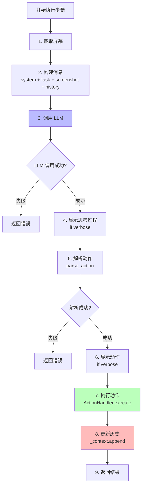

# Open-AutoGLM 代码阅读指南

> 本文档提供详细的代码阅读示例和注解，帮助你理解项目的每个关键部分。

## 目录

1. [入口点分析](#入口点分析)
2. [核心流程详解](#核心流程详解)
3. [关键模块代码注解](#关键模块代码注解)
4. [实战案例分析](#实战案例分析)

---

## 入口点分析

### 命令行入口：main.py

让我们从用户输入命令开始，跟踪整个执行流程：

```python
# main.py (简化版)

def main():
    # 1. 解析命令行参数
    parser = argparse.ArgumentParser(description="Phone Agent CLI")
    parser.add_argument("task", nargs="?", help="要执行的任务")
    parser.add_argument("--base-url", default="http://localhost:8000/v1")
    parser.add_argument("--model", default="autoglm-phone-9b")
    parser.add_argument("--device-id", help="设备ID")
    parser.add_argument("--verbose", action="store_true", help="显示详细信息")
    
    args = parser.parse_args()
    
    # 2. 检查系统要求（ADB、设备连接等）
    if not check_system_requirements():
        sys.exit(1)
    
    # 3. 创建配置对象
    model_config = ModelConfig(
        base_url=args.base_url,
        model_name=args.model,
    )
    
    agent_config = AgentConfig(
        device_id=args.device_id,
        verbose=args.verbose,
    )
    
    # 4. 创建 Agent 实例
    agent = PhoneAgent(
        model_config=model_config,
        agent_config=agent_config,
    )
    
    # 5. 执行任务
    if args.task:
        # 单次任务模式
        result = agent.run(args.task)
        print(f"✅ 任务完成：{result}")
    else:
        # 交互模式
        while True:
            task = input("请输入任务（输入 'quit' 退出）：")
            if task.lower() == "quit":
                break
            result = agent.run(task)
            print(f"✅ 结果：{result}")

if __name__ == "__main__":
    main()
```

**执行流程示意**：
```
用户输入: python main.py "打开微信"
    ↓
解析参数: task="打开微信", base_url="http://...", model="..."
    ↓
检查环境: ADB 已安装？设备已连接？
    ↓
创建配置: ModelConfig + AgentConfig
    ↓
创建 Agent: PhoneAgent(configs)
    ↓
执行任务: agent.run("打开微信")
    ↓
输出结果: "✅ 任务完成"
```

---

## 核心流程详解

### 1. PhoneAgent.run() - 任务执行入口

**位置**：`phone_agent/agent.py`

```python
class PhoneAgent:
    def run(self, task: str) -> str:
        """
        执行一个任务的完整流程
        
        Args:
            task: 用户的自然语言任务，如"打开微信"
            
        Returns:
            任务完成消息
        """
        # 初始化上下文
        self._context = []      # 对话历史：存储每一步的截图、思考、动作
        self._step_count = 0    # 步数计数器
        
        # 第一步：发送用户任务
        result = self._execute_step(task, is_first=True)
        
        if result.finished:
            return result.message or "任务完成"
        
        # 循环执行直到任务完成或达到最大步数
        while not result.finished and self._step_count < self.agent_config.max_steps:
            # 后续步骤不需要再次发送任务描述
            result = self._execute_step("", is_first=False)
            
            if not result.success:
                return f"任务失败：{result.message}"
        
        if self._step_count >= self.agent_config.max_steps:
            return "任务超时：达到最大步数限制"
        
        return result.message or "任务完成"
```

**关键点**：
1. `_context` 维护对话历史，让 LLM 知道之前做了什么
2. `_step_count` 防止无限循环
3. 第一步传入任务描述，后续步骤传入空字符串
4. 循环直到 `finished=True` 或超过最大步数

### 2. PhoneAgent._execute_step() - 单步执行

```python
def _execute_step(self, task: str, is_first: bool) -> StepResult:
    """
    执行单个步骤
    
    工作流程：
    1. 截图 → 2. 调用 LLM → 3. 解析动作 → 4. 执行动作 → 5. 更新历史
    """
    self._step_count += 1
    
    # === 步骤 1: 获取当前屏幕截图 ===
    screenshot_base64 = self.action_handler.device.take_screenshot()
    screen_width, screen_height = self.action_handler.device.get_screen_size()
    
    if self.agent_config.verbose:
        print(f"\n{'='*50}")
        print(f"📱 第 {self._step_count} 步")
        print(f"{'='*50}")
    
    # === 步骤 2: 构建发送给 LLM 的消息 ===
    messages = MessageBuilder.build(
        system_prompt=self.agent_config.system_prompt,  # 系统提示词
        task=task if is_first else "",                   # 第一步才包含任务
        screenshot=screenshot_base64,                    # 当前屏幕
        history=self._context,                           # 历史记录
        is_first=is_first,
    )
    
    # === 步骤 3: 调用 LLM 获取响应 ===
    try:
        response = self.model_client.request(messages)
    except Exception as e:
        return StepResult(
            success=False,
            finished=True,
            action=None,
            thinking="",
            message=f"LLM 调用失败：{e}"
        )
    
    # === 步骤 4: 显示思考过程（如果启用 verbose）===
    if self.agent_config.verbose:
        print(f"\n💭 思考过程:")
        print(f"{'-'*50}")
        print(response.thinking)
        print(f"{'-'*50}")
    
    # === 步骤 5: 解析动作 ===
    try:
        action = parse_action(response.action)
    except Exception as e:
        return StepResult(
            success=False,
            finished=False,
            action=None,
            thinking=response.thinking,
            message=f"动作解析失败：{e}"
        )
    
    # === 步骤 6: 显示动作（如果启用 verbose）===
    if self.agent_config.verbose:
        print(f"\n🎯 执行动作:")
        print(json.dumps(action, ensure_ascii=False, indent=2))
    
    # === 步骤 7: 执行动作 ===
    action_result = self.action_handler.execute(
        action, screen_width, screen_height
    )
    
    # === 步骤 8: 更新对话历史 ===
    self._context.append({
        "screenshot": screenshot_base64,
        "thinking": response.thinking,
        "action": action,
        "result": action_result.message,
    })
    
    # === 步骤 9: 返回结果 ===
    return StepResult(
        success=action_result.success,
        finished=action_result.should_finish,
        action=action,
        thinking=response.thinking,
        message=action_result.message,
    )
```

**执行流程可视化**：



### 3. ModelClient.request() - LLM 通信

**位置**：`phone_agent/model/client.py`

```python
def request(self, messages: list[dict[str, Any]]) -> ModelResponse:
    """
    向 LLM 发送请求并解析响应
    
    Args:
        messages: OpenAI 格式的消息列表
        
    Returns:
        ModelResponse(thinking, action, raw_content)
    """
    # 开始计时
    start_time = time.time()
    
    # === 1. 创建流式请求 ===
    stream = self.client.chat.completions.create(
        messages=messages,
        model=self.config.model_name,
        max_tokens=self.config.max_tokens,
        temperature=self.config.temperature,
        stream=True,  # 关键：启用流式传输
    )
    
    # === 2. 初始化变量 ===
    raw_content = ""      # 原始响应
    thinking = ""         # <think> 部分
    action = ""           # <answer> 部分
    in_thinking = False   # 当前是否在 <think> 标签内
    in_action = False     # 当前是否在 <answer> 标签内
    
    # === 3. 逐块处理流式响应 ===
    for chunk in stream:
        # 获取这一块的内容
        if len(chunk.choices) == 0:
            continue
        
        delta = chunk.choices[0].delta
        if delta.content is None:
            continue
        
        content = delta.content
        raw_content += content
        
        # === 4. 检测并提取 <think> 内容 ===
        if "<think>" in content:
            in_thinking = True
            content = content.split("<think>", 1)[1]
        
        if in_thinking:
            if "</think>" in content:
                # 提取 </think> 之前的内容
                part = content.split("</think>", 1)[0]
                thinking += part
                in_thinking = False
            else:
                thinking += content
        
        # === 5. 检测并提取 <answer> 内容 ===
        if "<answer>" in content:
            in_action = True
            content = content.split("<answer>", 1)[1]
        
        if in_action:
            if "</answer>" in content:
                part = content.split("</answer>", 1)[0]
                action += part
                in_action = False
            else:
                action += content
    
    # === 6. 返回解析结果 ===
    total_time = time.time() - start_time
    
    return ModelResponse(
        thinking=thinking.strip(),
        action=action.strip(),
        raw_content=raw_content,
        total_time=total_time,
    )
```

**LLM 响应格式示例**：
```xml
<think>
当前在系统桌面，用户要求打开微信。
我需要执行 Launch 动作，启动微信应用。
微信的包名是 com.tencent.mm
</think>
<answer>
do(action="Launch", app="微信")
</answer>
```

**解析过程**：
1. 检测到 `<think>`，开始收集思考内容
2. 遇到 `</think>`，停止收集，thinking = "当前在系统桌面..."
3. 检测到 `<answer>`，开始收集动作内容
4. 遇到 `</answer>`，停止收集，action = 'do(action="Launch", app="微信")'

### 4. parse_action() - 动作解析

**位置**：`phone_agent/actions/handler.py`

```python
def parse_action(action_str: str) -> dict[str, Any]:
    """
    解析 LLM 返回的动作字符串
    
    输入示例：
        do(action="Tap", element=[100, 200])
        finish(message="任务完成")
    
    输出示例：
        {"_metadata": "do", "action": "Tap", "element": [100, 200]}
        {"_metadata": "finish", "message": "任务完成"}
    """
    action_str = action_str.strip()
    
    # === 1. 识别动作类型 ===
    if action_str.startswith("do("):
        metadata = "do"
        # 提取括号内的内容
        content = action_str[3:-1]  # 去掉 "do(" 和 ")"
    elif action_str.startswith("finish("):
        metadata = "finish"
        content = action_str[7:-1]  # 去掉 "finish(" 和 ")"
    else:
        raise ValueError(f"未知的动作格式：{action_str}")
    
    # === 2. 解析参数（简化版）===
    # 实际实现使用正则表达式或 AST 解析
    # 这里展示简化逻辑
    
    result = {"_metadata": metadata}
    
    # 示例：解析 action="Tap", element=[100, 200]
    # 这里用 eval 是不安全的，实际项目中用更安全的方法
    params = eval(f"dict({content})")
    result.update(params)
    
    return result
```

**解析示例**：

```python
# 输入 1
action_str = 'do(action="Launch", app="微信")'
# 输出
{
    "_metadata": "do",
    "action": "Launch",
    "app": "微信"
}

# 输入 2
action_str = 'do(action="Tap", element=[500, 800])'
# 输出
{
    "_metadata": "do",
    "action": "Tap",
    "element": [500, 800]
}

# 输入 3
action_str = 'finish(message="任务已完成")'
# 输出
{
    "_metadata": "finish",
    "message": "任务已完成"
}
```

### 5. ActionHandler.execute() - 动作执行

**位置**：`phone_agent/actions/handler.py`

```python
def execute(self, action: dict[str, Any], screen_width: int, screen_height: int) -> ActionResult:
    """
    执行一个动作
    
    Args:
        action: 动作字典，包含 _metadata 和具体参数
        screen_width: 屏幕宽度
        screen_height: 屏幕高度
    
    Returns:
        ActionResult(success, should_finish, message)
    """
    # === 1. 获取动作类型 ===
    action_type = action.get("_metadata")
    
    # === 2. 特殊处理 finish ===
    if action_type == "finish":
        return ActionResult(
            success=True,
            should_finish=True,
            message=action.get("message", "任务完成")
        )
    
    # === 3. 检查是否是 do 类型 ===
    if action_type != "do":
        return ActionResult(
            success=False,
            should_finish=True,
            message=f"未知的动作类型：{action_type}"
        )
    
    # === 4. 获取具体动作名称 ===
    action_name = action.get("action")
    
    # === 5. 查找对应的处理器 ===
    handler = self._get_handler(action_name)
    
    if handler is None:
        return ActionResult(
            success=False,
            should_finish=False,
            message=f"不支持的动作：{action_name}"
        )
    
    # === 6. 执行动作 ===
    try:
        return handler(action, screen_width, screen_height)
    except Exception as e:
        return ActionResult(
            success=False,
            should_finish=False,
            message=f"动作执行失败：{e}"
        )

def _get_handler(self, action_name: str) -> Callable | None:
    """获取动作处理器"""
    handlers = {
        "Launch": self._handle_launch,
        "Tap": self._handle_tap,
        "Type": self._handle_type,
        "Swipe": self._handle_swipe,
        "Back": self._handle_back,
        "Home": self._handle_home,
        # ... 其他动作
    }
    return handlers.get(action_name)
```

**具体动作实现示例**：

#### Tap 动作
```python
def _handle_tap(self, action: dict, w: int, h: int) -> ActionResult:
    """
    处理点击动作
    
    action 格式：
        {"action": "Tap", "element": [100, 200]}
        或
        {"action": "Tap", "element": [0.5, 0.3]}  # 百分比
    """
    element = action.get("element", [])
    
    if len(element) != 2:
        return ActionResult(
            success=False,
            should_finish=False,
            message="Tap 动作需要 [x, y] 坐标"
        )
    
    x, y = element[0], element[1]
    
    # 如果是百分比（0~1），转换为绝对坐标
    if 0 <= x <= 1:
        x = int(x * w)
    if 0 <= y <= 1:
        y = int(y * h)
    
    # 调用设备控制层执行点击
    self.device.tap(x, y)
    
    # 等待页面响应
    time.sleep(TIMING_CONFIG.after_tap)
    
    return ActionResult(
        success=True,
        should_finish=False,
        message=f"已点击 ({x}, {y})"
    )
```

#### Launch 动作
```python
def _handle_launch(self, action: dict, w: int, h: int) -> ActionResult:
    """
    处理启动应用动作
    
    action 格式：
        {"action": "Launch", "app": "微信"}
    """
    app_name = action.get("app", "")
    
    # 查找应用包名
    from phone_agent.config.apps import SUPPORTED_APPS
    
    package_name = SUPPORTED_APPS.get(app_name)
    
    if package_name is None:
        return ActionResult(
            success=False,
            should_finish=False,
            message=f"未找到应用：{app_name}"
        )
    
    # 调用设备控制层启动应用
    self.device.launch_app(package_name)
    
    # 等待应用启动
    time.sleep(TIMING_CONFIG.after_launch)
    
    return ActionResult(
        success=True,
        should_finish=False,
        message=f"已启动 {app_name}"
    )
```

---

## 关键模块代码注解

### 1. 设备控制层 - ADB 封装

**位置**：`phone_agent/adb/device.py`

```python
import subprocess
from typing import Optional

def tap(x: int, y: int, device_id: Optional[str] = None):
    """
    点击屏幕指定坐标
    
    Args:
        x: X 坐标
        y: Y 坐标
        device_id: 设备 ID（多设备时需要）
    
    实现原理：
        调用 ADB 命令：adb shell input tap x y
    """
    # 构建命令
    cmd = ["adb"]
    
    # 如果指定了设备 ID，添加 -s 参数
    if device_id:
        cmd.extend(["-s", device_id])
    
    # 添加点击命令
    cmd.extend(["shell", "input", "tap", str(x), str(y)])
    
    # 执行命令
    # check=True 表示如果命令失败会抛出异常
    subprocess.run(cmd, check=True, capture_output=True)

def launch_app(package_name: str, device_id: Optional[str] = None):
    """
    启动应用
    
    Args:
        package_name: 应用包名，格式如 "com.tencent.mm/.ui.LauncherUI"
    
    实现原理：
        调用 ADB 命令：adb shell am start -n package_name
    """
    cmd = ["adb"]
    if device_id:
        cmd.extend(["-s", device_id])
    cmd.extend(["shell", "am", "start", "-n", package_name])
    
    subprocess.run(cmd, check=True, capture_output=True)

def swipe(x1: int, y1: int, x2: int, y2: int, duration: int = 300, device_id: Optional[str] = None):
    """
    滑动屏幕
    
    Args:
        x1, y1: 起点坐标
        x2, y2: 终点坐标
        duration: 滑动时长（毫秒）
    
    实现原理：
        调用 ADB 命令：adb shell input swipe x1 y1 x2 y2 duration
    """
    cmd = ["adb"]
    if device_id:
        cmd.extend(["-s", device_id])
    cmd.extend(["shell", "input", "swipe", str(x1), str(y1), str(x2), str(y2), str(duration)])
    
    subprocess.run(cmd, check=True, capture_output=True)

def type_text(text: str, device_id: Optional[str] = None):
    """
    输入文本（需要 ADB Keyboard）
    
    Args:
        text: 要输入的文本
    
    注意：
        1. 需要安装 ADB Keyboard
        2. 需要切换到 ADB Keyboard 输入法
        3. 只支持 ASCII 字符直接输入
        4. 中文需要通过 broadcast 方式
    """
    # 对于中文，使用 broadcast 方式
    # 对于英文，可以用 input text
    if any(ord(c) > 127 for c in text):  # 包含非 ASCII 字符
        # 使用 broadcast
        cmd = ["adb"]
        if device_id:
            cmd.extend(["-s", device_id])
        cmd.extend([
            "shell",
            "am", "broadcast",
            "-a", "ADB_INPUT_TEXT",
            "--es", "msg", text
        ])
    else:
        # 使用 input text
        cmd = ["adb"]
        if device_id:
            cmd.extend(["-s", device_id])
        # 需要转义特殊字符
        escaped = text.replace(" ", "%s").replace("&", "\\&")
        cmd.extend(["shell", "input", "text", escaped])
    
    subprocess.run(cmd, check=True, capture_output=True)
```

### 2. 截图模块

**位置**：`phone_agent/adb/screenshot.py`

```python
import base64
import subprocess
import tempfile
import os

def take_screenshot(device_id: Optional[str] = None) -> str:
    """
    获取屏幕截图并返回 base64 编码
    
    Returns:
        base64 编码的 PNG 图片字符串
    
    流程：
        1. 在设备上截图并保存
        2. 从设备拉取到本地临时文件
        3. 读取文件并 base64 编码
        4. 删除临时文件
    """
    # === 1. 创建临时文件 ===
    with tempfile.NamedTemporaryFile(suffix=".png", delete=False) as tmp:
        tmp_path = tmp.name
    
    try:
        # === 2. 设备上截图路径 ===
        device_path = "/sdcard/screenshot.png"
        
        # === 3. 在设备上截图 ===
        cmd = ["adb"]
        if device_id:
            cmd.extend(["-s", device_id])
        cmd.extend(["shell", "screencap", "-p", device_path])
        
        subprocess.run(cmd, check=True, capture_output=True)
        
        # === 4. 拉取到本地 ===
        cmd = ["adb"]
        if device_id:
            cmd.extend(["-s", device_id])
        cmd.extend(["pull", device_path, tmp_path])
        
        subprocess.run(cmd, check=True, capture_output=True)
        
        # === 5. 读取并编码 ===
        with open(tmp_path, "rb") as f:
            image_data = f.read()
        
        # base64 编码
        base64_str = base64.b64encode(image_data).decode("utf-8")
        
        return base64_str
        
    finally:
        # === 6. 清理临时文件 ===
        if os.path.exists(tmp_path):
            os.remove(tmp_path)

def get_screen_size(device_id: Optional[str] = None) -> tuple[int, int]:
    """
    获取屏幕尺寸
    
    Returns:
        (width, height) 元组
    
    实现：
        解析 adb shell wm size 的输出
    """
    cmd = ["adb"]
    if device_id:
        cmd.extend(["-s", device_id])
    cmd.extend(["shell", "wm", "size"])
    
    # 执行并获取输出
    result = subprocess.run(cmd, capture_output=True, text=True, check=True)
    
    # 输出格式："Physical size: 1080x2400"
    output = result.stdout.strip()
    
    # 提取尺寸
    size_part = output.split(":")[-1].strip()  # "1080x2400"
    width, height = map(int, size_part.split("x"))
    
    return width, height
```

---

## 实战案例分析

### 案例 1：打开微信并发送消息

**用户输入**：
```bash
python main.py "打开微信，给文件传输助手发消息：测试"
```

**执行流程详解**：

#### 第 1 步：启动微信

**屏幕状态**：桌面

**LLM 思考**：
```
当前在系统桌面，用户要求打开微信并发送消息。
第一步需要启动微信应用。
```

**LLM 动作**：
```python
do(action="Launch", app="微信")
```

**代码执行**：
```python
# ActionHandler._handle_launch()
package_name = SUPPORTED_APPS["微信"]  # "com.tencent.mm/.ui.LauncherUI"
device.launch_app(package_name)
# 实际执行：adb shell am start -n com.tencent.mm/.ui.LauncherUI
```

#### 第 2 步：搜索联系人

**屏幕状态**：微信首页（显示聊天列表）

**LLM 思考**：
```
微信已打开，现在需要找到"文件传输助手"。
我看到右上角有搜索图标，坐标大约在 [950, 100]。
点击搜索图标进入搜索页面。
```

**LLM 动作**：
```python
do(action="Tap", element=[950, 100])
```

**代码执行**：
```python
# ActionHandler._handle_tap()
x, y = 950, 100
device.tap(950, 100)
# 实际执行：adb shell input tap 950 100
```

#### 第 3 步：输入搜索关键词

**屏幕状态**：搜索页面（显示搜索框）

**LLM 思考**：
```
已进入搜索页面，看到搜索框。
需要点击搜索框并输入"文件传输助手"。
搜索框位置大约在 [540, 150]。
```

**LLM 动作**：
```python
do(action="Tap", element=[540, 150])
```

#### 第 4 步：输入文字

**屏幕状态**：搜索框已激活（显示键盘）

**LLM 思考**：
```
搜索框已激活，现在需要输入"文件传输助手"。
```

**LLM 动作**：
```python
do(action="Type", text="文件传输助手")
```

**代码执行**：
```python
# ActionHandler._handle_type()
# 1. 切换到 ADB Keyboard
device.switch_to_adb_keyboard()
# 2. 输入文字
device.type_text("文件传输助手")
# 实际执行：adb shell am broadcast -a ADB_INPUT_TEXT --es msg "文件传输助手"
```

#### 第 5 步：选择联系人

**屏幕状态**：搜索结果列表（显示"文件传输助手"）

**LLM 思考**：
```
搜索结果已显示，看到"文件传输助手"在列表第一个。
点击它进入聊天界面。
位置大约在 [540, 300]。
```

**LLM 动作**：
```python
do(action="Tap", element=[540, 300])
```

#### 第 6 步：点击输入框

**屏幕状态**：聊天界面

**LLM 思考**：
```
已进入聊天界面，需要发送消息"测试"。
首先点击底部的输入框。
位置大约在 [540, 2200]。
```

**LLM 动作**：
```python
do(action="Tap", element=[540, 2200])
```

#### 第 7 步：输入消息

**屏幕状态**：输入框已激活

**LLM 思考**：
```
输入框已激活，输入消息"测试"。
```

**LLM 动作**：
```python
do(action="Type", text="测试")
```

#### 第 8 步：发送消息

**屏幕状态**：已输入文字，显示发送按钮

**LLM 思考**：
```
消息已输入，现在点击发送按钮。
发送按钮通常在右下角，位置大约 [1000, 2200]。
```

**LLM 动作**：
```python
do(action="Tap", element=[1000, 2200])
```

#### 第 9 步：确认完成

**屏幕状态**：消息已发送

**LLM 思考**：
```
消息已成功发送，可以看到聊天记录中出现了"测试"。
任务已完成。
```

**LLM 动作**：
```python
finish(message="已成功给文件传输助手发送消息：测试")
```

**最终输出**：
```
✅ 任务完成：已成功给文件传输助手发送消息：测试
```

---

### 案例 2：代码执行流程跟踪

让我们跟踪一次完整的函数调用栈：

```
用户执行：python main.py "打开微信"

调用栈：
1. main.py:main()
   ├─ 解析参数
   ├─ 创建 ModelConfig
   ├─ 创建 AgentConfig
   ├─ 创建 PhoneAgent(model_config, agent_config)
   │  ├─ self.model_client = ModelClient(model_config)
   │  └─ self.action_handler = ActionHandler(device_id)
   │
   └─ agent.run("打开微信")
      
2. phone_agent/agent.py:PhoneAgent.run()
   ├─ self._context = []
   ├─ self._step_count = 0
   └─ result = self._execute_step("打开微信", is_first=True)
   
3. phone_agent/agent.py:PhoneAgent._execute_step()
   ├─ screenshot = self.action_handler.device.take_screenshot()
   │  └─ phone_agent/adb/screenshot.py:take_screenshot()
   │     ├─ subprocess.run(["adb", "shell", "screencap", "-p", ...])
   │     ├─ subprocess.run(["adb", "pull", ...])
   │     └─ return base64.b64encode(image_data).decode()
   │
   ├─ messages = MessageBuilder.build(...)
   │  └─ phone_agent/model/client.py:MessageBuilder.build()
   │     └─ return [
   │          {"role": "system", "content": system_prompt},
   │          {"role": "user", "content": [
   │              {"type": "text", "text": "打开微信"},
   │              {"type": "image_url", "image_url": {...}}
   │          ]}
   │        ]
   │
   ├─ response = self.model_client.request(messages)
   │  └─ phone_agent/model/client.py:ModelClient.request()
   │     ├─ stream = self.client.chat.completions.create(...)
   │     │  └─ OpenAI API HTTP POST 请求
   │     │     └─ LLM 服务处理并返回流式响应
   │     │
   │     ├─ 解析流式响应
   │     │  ├─ 提取 <think> 内容 → thinking
   │     │  └─ 提取 <answer> 内容 → action
   │     │
   │     └─ return ModelResponse(thinking, action, ...)
   │
   ├─ action = parse_action(response.action)
   │  └─ phone_agent/actions/handler.py:parse_action()
   │     └─ return {"_metadata": "do", "action": "Launch", "app": "微信"}
   │
   ├─ action_result = self.action_handler.execute(action, w, h)
   │  └─ phone_agent/actions/handler.py:ActionHandler.execute()
   │     ├─ handler = self._get_handler("Launch")
   │     │  └─ return self._handle_launch
   │     │
   │     └─ return handler(action, w, h)
   │        └─ phone_agent/actions/handler.py:ActionHandler._handle_launch()
   │           ├─ package_name = SUPPORTED_APPS["微信"]
   │           ├─ self.device.launch_app(package_name)
   │           │  └─ phone_agent/adb/device.py:launch_app()
   │           │     └─ subprocess.run(["adb", "shell", "am", "start", "-n", package_name])
   │           │
   │           └─ return ActionResult(success=True, should_finish=False)
   │
   ├─ self._context.append({...})
   └─ return StepResult(...)

4. 返回 phone_agent/agent.py:PhoneAgent.run()
   ├─ 检查 result.finished（第一步通常不会完成）
   └─ 继续循环：result = self._execute_step("", is_first=False)
      └─ 重复步骤 3，直到收到 finish() 动作

5. 返回 main.py:main()
   └─ print(f"✅ 任务完成：{result}")
```

---

## 总结

### 核心数据流

```
用户任务 (str)
    ↓
PhoneAgent
    ↓
截图 (base64) + 历史 (list)
    ↓
ModelClient → LLM
    ↓
响应 (thinking + action)
    ↓
parse_action → 动作字典 (dict)
    ↓
ActionHandler → 具体处理器
    ↓
ADB 命令 (subprocess)
    ↓
设备执行
```

### 关键设计模式

1. **策略模式**：ActionHandler 根据动作类型选择不同的处理器
2. **建造者模式**：MessageBuilder 构建复杂的消息对象
3. **迭代器模式**：流式处理 LLM 响应
4. **状态机模式**：Agent 维护执行状态（_context, _step_count）

### 阅读建议

1. **自顶向下**：从 main.py 开始，逐步深入
2. **添加日志**：在关键位置添加 print，观察数据流
3. **单步调试**：使用 IDE 的调试功能，设置断点
4. **修改实验**：尝试修改参数，观察行为变化

---

**希望这份代码阅读指南能帮助你更好地理解项目！** 📖
