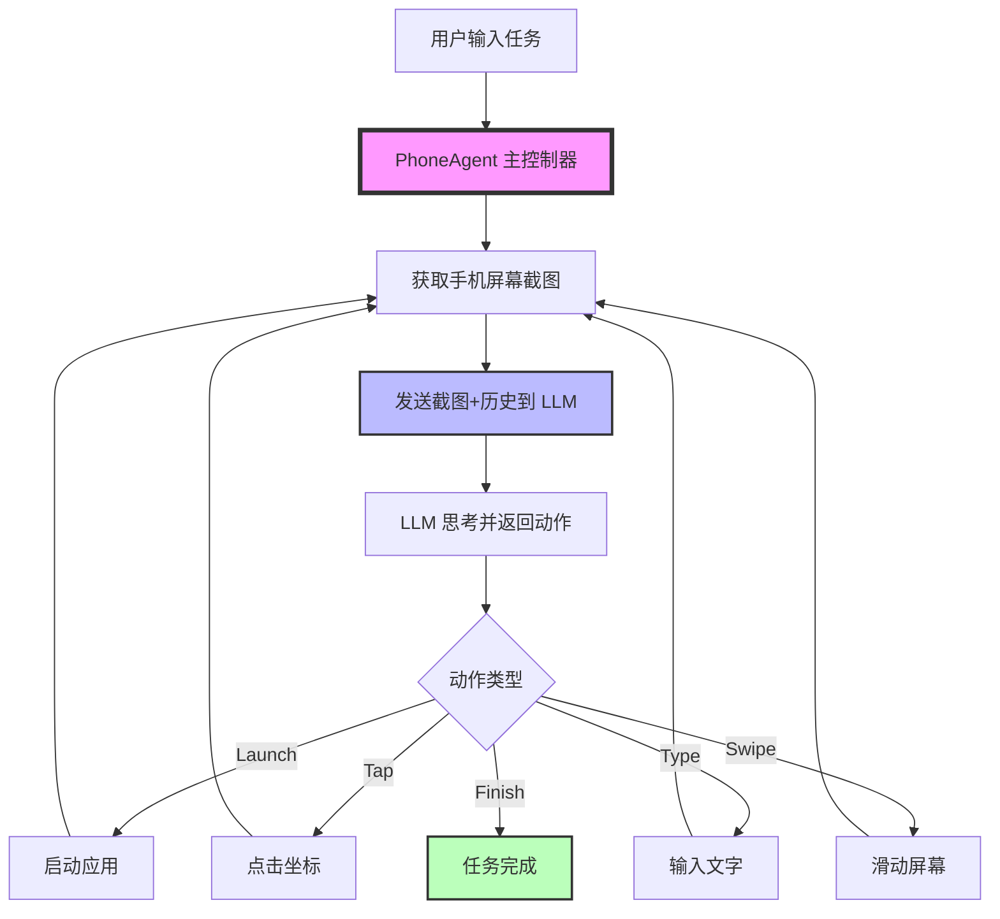
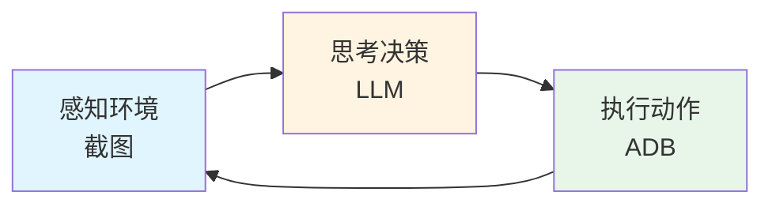
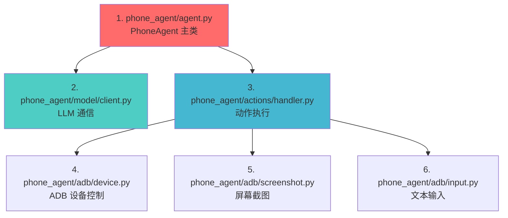
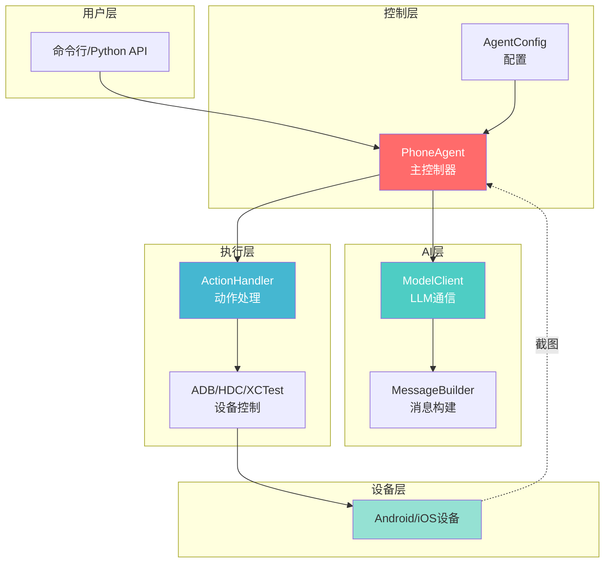
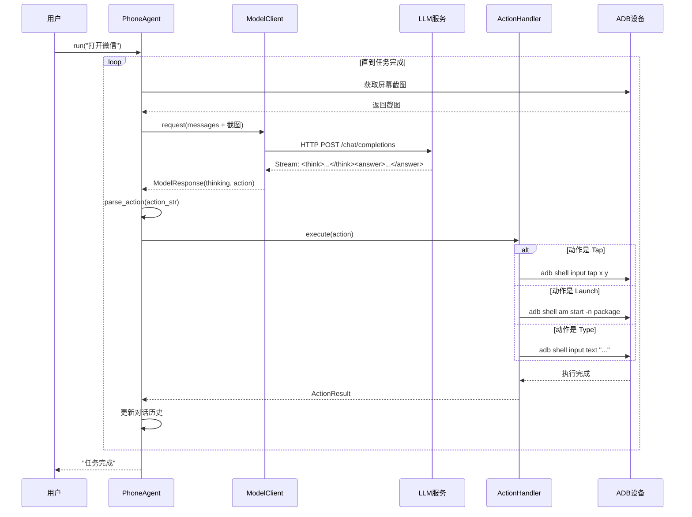
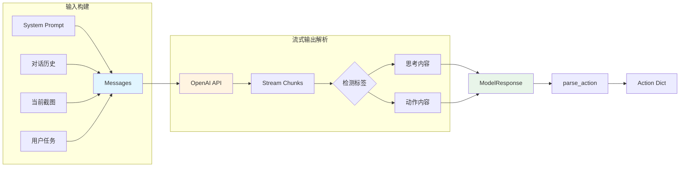
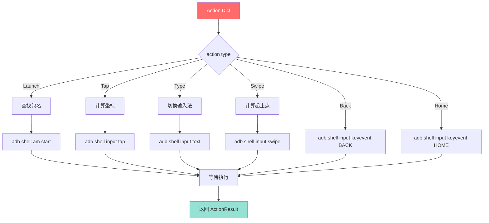

# Open-AutoGLM 学习指南

> 本指南专为具有基础Python知识和C语言编程背景的学习者设计，帮助你系统地理解这个LLM驱动的手机自动化项目。

## 目录

1. [项目概览](#项目概览)
2. [核心概念](#核心概念)
3. [推荐阅读路径](#推荐阅读路径)
4. [架构流程图](#架构流程图)
5. [Python语法补充](#python语法补充)
6. [关键模块详解](#关键模块详解)

---

## 项目概览

### 这个项目是做什么的？

Open-AutoGLM 是一个**手机自动化助理框架**，可以理解为：

```
你说话 → AI理解 → 自动操作手机 → 完成任务
```

**举例**：
- 你说："打开微信，给张三发消息说晚上一起吃饭"
- AI 自动：打开微信 → 搜索张三 → 打开聊天 → 输入文字 → 发送

### 核心技术栈

| 技术 | 作用 | 类比（C语言背景） |
|------|------|------------------|
| **LLM (大语言模型)** | 理解屏幕、决策下一步操作 | 类似一个超级智能的if-else决策引擎 |
| **ADB (Android Debug Bridge)** | 控制安卓手机 | 类似system()调用外部命令 |
| **OpenAI API** | 与AI模型通信 | 类似HTTP客户端库 |
| **视觉理解** | 看懂屏幕截图 | 图像识别 + OCR + 语义理解 |

### 整体架构



---

## 核心概念

### 1. LLM (Large Language Model) - 大语言模型

**类比**：想象一个读过全世界所有书的超级聪明人，能理解图片和文字，并做出决策。

**在本项目中的作用**：
- 看懂手机屏幕（图像 → 语义）
- 理解用户任务（"打开微信" → Launch 动作）
- 规划操作步骤（先启动→再搜索→再点击）

**与传统编程的区别**：
```c
// 传统方式（硬编码）
if (task == "打开微信") {
    launch_app("com.tencent.mm");
}

// LLM方式（智能理解）
// AI 自己理解任务，不需要枚举所有情况
// 甚至能处理从未见过的新任务
```

### 2. Agent 模式

**定义**：Agent = 感知 + 决策 + 执行 的循环系统



**对应本项目**：
- **感知**：手机截图 (phone_agent/adb/screenshot.py)
- **决策**：LLM推理 (phone_agent/model/client.py)
- **执行**：ADB命令 (phone_agent/adb/device.py)

### 3. 多模态 (Multimodal)

**含义**：同时处理多种类型的输入（文字 + 图片）

```python
# 发送给 LLM 的消息包含：
messages = [
    {"role": "system", "content": "你是手机助理"},  # 文字
    {"role": "user", "content": [
        {"type": "text", "text": "打开微信"},         # 文字
        {"type": "image_url", "image_url": {...}}   # 图片（屏幕截图）
    ]}
]
```

---

## 推荐阅读路径

### 第一阶段：快速理解（1-2小时）

**目标**：了解项目做什么、怎么运行

1. **README.md** (15分钟)
   - 先看"项目介绍"和"使用 AutoGLM"章节
   - 理解基本用法

2. **examples/basic_usage.py** (20分钟)
   - 看最简单的使用示例
   - 理解 `PhoneAgent` 的基本 API

3. **main.py** 的 `main()` 函数 (30分钟)
   - 看命令行如何解析参数
   - 理解启动流程

4. **运行演示** (30分钟)
   - 如果有手机，实际运行一次
   - 观察日志输出

**学习检查点**：
- [ ] 能用一句话解释项目功能
- [ ] 知道如何运行一个简单任务
- [ ] 理解 `PhoneAgent.run()` 的作用

---

### 第二阶段：核心流程（3-4小时）

**目标**：理解从输入到执行的完整流程

#### 推荐阅读顺序：



#### 1. **phone_agent/agent.py** (60分钟)

**关键类和方法**：
```python
class PhoneAgent:
    def run(self, task: str) -> str:
        # 这是整个系统的入口
        # 1. 初始化上下文
        # 2. 循环执行步骤直到完成
        pass
    
    def _execute_step(self, task: str, is_first: bool) -> StepResult:
        # 单步执行
        # 1. 获取屏幕截图
        # 2. 调用 LLM
        # 3. 解析动作
        # 4. 执行动作
        pass
```

**阅读重点**：
- 理解 `run()` 中的主循环
- 理解 `_execute_step()` 的四个步骤
- 理解如何维护对话历史 (`_context`)

**C语言类比**：
```c
// 类似一个状态机
while (!task_finished && steps < max_steps) {
    screenshot = capture_screen();
    action = ask_ai(screenshot, history);
    execute_action(action);
    update_history(action);
}
```

#### 2. **phone_agent/model/client.py** (45分钟)

**关键类**：
```python
class ModelClient:
    def request(self, messages: list) -> ModelResponse:
        # 调用 OpenAI API
        # 使用流式传输获取响应
        # 解析 <think> 和 <answer> 标签
        pass
```

**阅读重点**：
- 理解如何构造发送给 LLM 的消息
- 理解流式响应 (streaming) 的处理
- 理解 thinking 和 action 的分离

**关键概念**：
```python
# LLM 返回格式：
# <think>这里是思考过程...</think>
# <answer>do(action="Tap", element=[100, 200])</answer>
```

#### 3. **phone_agent/actions/handler.py** (45分钟)

**关键类**：
```python
class ActionHandler:
    def execute(self, action: dict, screen_width: int, screen_height: int) -> ActionResult:
        # 根据 action 类型调用不同的 handler
        pass
    
    def _handle_tap(self, action, w, h):
        # 执行点击
        pass
    
    def _handle_launch(self, action, w, h):
        # 启动应用
        pass
```

**阅读重点**：
- 理解动作分发机制 (`_get_handler`)
- 看几个典型动作的实现（Tap, Launch, Type）
- 理解敏感操作确认机制

#### 4. **phone_agent/adb/device.py** (30分钟)

**关键函数**：
```python
def tap(x: int, y: int, device_id: str = None):
    # 调用 adb shell input tap x y
    pass

def launch_app(package_name: str, device_id: str = None):
    # 调用 adb shell am start -n package_name
    pass
```

**阅读重点**：
- 理解如何通过 subprocess 调用 adb 命令
- 看几个基本操作的实现

**C语言类比**：
```c
// 类似于
system("adb shell input tap 100 200");
```

#### 5-6. **截图和输入模块** (30分钟)

快速浏览即可，理解基本功能。

**学习检查点**：
- [ ] 能画出从用户输入到动作执行的完整流程图
- [ ] 理解 LLM 在系统中的角色
- [ ] 理解如何维护对话历史
- [ ] 能解释 Agent 循环的工作原理

---

### 第三阶段：配置和扩展（2-3小时）

**目标**：理解如何配置和扩展系统

1. **phone_agent/config/prompts_zh.py** (30分钟)
   - 理解系统提示词 (System Prompt)
   - 理解如何引导 LLM 的行为

2. **phone_agent/config/apps.py** (20分钟)
   - 理解应用包名映射
   - 学习如何添加新应用

3. **phone_agent/device_factory.py** (20分钟)
   - 理解设备类型抽象
   - 理解如何支持多种设备 (ADB/HDC/iOS)

4. **examples/** 下的其他示例 (40分钟)
   - 学习高级用法
   - 理解回调机制

**学习检查点**：
- [ ] 能修改系统提示词
- [ ] 能添加新的支持应用
- [ ] 理解如何自定义回调

---

### 第四阶段：深入研究（选学）

如果你想深入理解或二次开发：

1. **phone_agent/hdc/** - 鸿蒙设备支持
2. **phone_agent/xctest/** - iOS 设备支持
3. **tests/** - 单元测试
4. **scripts/** - 部署脚本

---

## 架构流程图

### 1. 整体架构图



### 2. 任务执行流程



### 3. LLM 交互细节



### 4. 动作执行流程



---

## Python语法补充

### 1. 类型注解 (Type Hints)

**C语言对比**：
```c
// C语言：类型在变量前
int add(int a, int b) {
    return a + b;
}
```

```python
# Python：类型在变量后（仅提示，不强制）
def add(a: int, b: int) -> int:
    return a + b

# 常见类型注解
name: str = "张三"                    # 字符串
age: int = 25                         # 整数
score: float = 98.5                   # 浮点数
is_active: bool = True                # 布尔
items: list[str] = ["a", "b"]        # 字符串列表
config: dict[str, int] = {"x": 1}    # 字典
result: str | None = None             # 可能是字符串或None（Python 3.10+）

# 函数类型注解
def process(data: list[int]) -> dict[str, float]:
    return {"avg": sum(data) / len(data)}
```

**在本项目中的应用**：
```python
# phone_agent/agent.py
def run(self, task: str) -> str:
    # task 参数是 str 类型
    # 返回值也是 str 类型
    pass

# phone_agent/model/client.py
def request(self, messages: list[dict[str, Any]]) -> ModelResponse:
    # messages 是字典列表
    # 返回 ModelResponse 对象
    pass
```

### 2. 数据类 (Dataclasses)

**用途**：快速创建数据容器类，类似 C 语言的 struct

**C语言对比**：
```c
// C语言 struct
struct Config {
    int max_steps;
    char* device_id;
    int verbose;
};

struct Config config = {100, NULL, 1};
```

```python
# Python dataclass
from dataclasses import dataclass

@dataclass
class Config:
    max_steps: int = 100
    device_id: str | None = None
    verbose: bool = True

# 使用
config = Config()                           # 使用默认值
config2 = Config(max_steps=50)             # 部分指定
config3 = Config(200, "device1", False)    # 全部指定

# 自动生成 __init__, __repr__, __eq__ 等方法
print(config)  # Config(max_steps=100, device_id=None, verbose=True)
```

**在本项目中的应用**：
```python
# phone_agent/agent.py
@dataclass
class AgentConfig:
    max_steps: int = 100
    device_id: str | None = None
    lang: str = "cn"
    verbose: bool = True

# phone_agent/model/client.py
@dataclass
class ModelConfig:
    base_url: str = "http://localhost:8000/v1"
    api_key: str = "EMPTY"
    model_name: str = "autoglm-phone-9b"
    max_tokens: int = 3000
```

**好处**：
- 自动生成构造函数
- 自动生成字符串表示
- 支持默认值
- 代码简洁

### 3. 装饰器 (Decorators)

**本质**：函数的包装器，用于修改或增强函数行为

**基本原理**：
```python
# 装饰器是一个接受函数并返回新函数的函数
def my_decorator(func):
    def wrapper(*args, **kwargs):
        print("函数执行前")
        result = func(*args, **kwargs)
        print("函数执行后")
        return result
    return wrapper

# 使用装饰器
@my_decorator
def say_hello(name):
    print(f"Hello, {name}")

# 等价于：
# say_hello = my_decorator(say_hello)

say_hello("张三")
# 输出：
# 函数执行前
# Hello, 张三
# 函数执行后
```

**常见装饰器**：
```python
# @property - 将方法变成属性
class Person:
    def __init__(self, name):
        self._name = name
    
    @property
    def name(self):
        return self._name
    
    @name.setter
    def name(self, value):
        self._name = value

p = Person("张三")
print(p.name)        # 当作属性访问，不用加()
p.name = "李四"      # 当作属性赋值

# @staticmethod - 静态方法（不需要self）
class Math:
    @staticmethod
    def add(a, b):
        return a + b

result = Math.add(1, 2)  # 不需要实例化

# @dataclass - 数据类装饰器（见上节）
```

### 4. 字典解包和关键字参数

```python
# ** 用于字典解包
config = {"max_steps": 100, "verbose": True}
agent = PhoneAgent(**config)
# 等价于：
# agent = PhoneAgent(max_steps=100, verbose=True)

# * 用于列表解包
numbers = [1, 2, 3]
print(*numbers)  # 等价于 print(1, 2, 3)

# 函数定义中的 *args 和 **kwargs
def flexible_func(*args, **kwargs):
    # args 是元组，包含所有位置参数
    # kwargs 是字典，包含所有关键字参数
    print(args)
    print(kwargs)

flexible_func(1, 2, name="张三", age=25)
# args: (1, 2)
# kwargs: {'name': '张三', 'age': 25}
```

**在本项目中的应用**：
```python
# phone_agent/model/client.py
stream = self.client.chat.completions.create(
    messages=messages,
    model=self.config.model_name,
    max_tokens=self.config.max_tokens,
    temperature=self.config.temperature,
    extra_body=self.config.extra_body,  # 字典，会被解包
    stream=True,
)
```

### 5. 列表推导式 (List Comprehension)

**C语言对比**：
```c
// C语言：循环填充数组
int squares[10];
for (int i = 0; i < 10; i++) {
    squares[i] = i * i;
}
```

```python
# Python：列表推导式（一行代码）
squares = [i * i for i in range(10)]

# 带条件的列表推导式
even_squares = [i * i for i in range(10) if i % 2 == 0]
# 结果：[0, 4, 16, 36, 64]

# 嵌套推导式
matrix = [[i * j for j in range(3)] for i in range(3)]
# 结果：[[0, 0, 0], [0, 1, 2], [0, 2, 4]]
```

**字典推导式**：
```python
# 创建字典
squares_dict = {i: i * i for i in range(5)}
# 结果：{0: 0, 1: 1, 2: 4, 3: 9, 4: 16}

# 过滤字典
data = {"a": 1, "b": 2, "c": 3}
filtered = {k: v for k, v in data.items() if v > 1}
# 结果：{'b': 2, 'c': 3}
```

### 6. with 语句和上下文管理器

**用途**：自动资源管理（类似 C++ 的 RAII）

```python
# 传统方式
file = open("data.txt", "r")
try:
    content = file.read()
finally:
    file.close()  # 必须手动关闭

# with 语句（推荐）
with open("data.txt", "r") as file:
    content = file.read()
    # 离开 with 块时自动关闭文件
```

**C语言类比**：
```c
// C语言需要手动管理资源
FILE* f = fopen("data.txt", "r");
if (f) {
    // 使用文件
    fclose(f);  // 容易忘记
}
```

**自定义上下文管理器**：
```python
from contextlib import contextmanager

@contextmanager
def timing(name):
    import time
    start = time.time()
    yield
    print(f"{name} took {time.time() - start:.2f}s")

# 使用
with timing("数据处理"):
    # 这里的代码会被计时
    sum([i * i for i in range(1000000)])
```

### 7. f-string 格式化字符串

```python
# 传统方式
name = "张三"
age = 25
print("我叫" + name + "，今年" + str(age) + "岁")

# % 格式化（旧）
print("我叫%s，今年%d岁" % (name, age))

# .format()（较旧）
print("我叫{}，今年{}岁".format(name, age))

# f-string（推荐，Python 3.6+）
print(f"我叫{name}，今年{age}岁")

# f-string 可以包含表达式
print(f"明年我{age + 1}岁")
print(f"我的名字有{len(name)}个字")

# 格式化数字
pi = 3.14159
print(f"π ≈ {pi:.2f}")  # 保留2位小数：π ≈ 3.14
```

**在本项目中的应用**：
```python
# phone_agent/adb/device.py
def tap(x: int, y: int, device_id: str = None):
    cmd = f"adb shell input tap {x} {y}"
    if device_id:
        cmd = f"adb -s {device_id} shell input tap {x} {y}"
    subprocess.run(cmd, shell=True)
```

### 8. 可选类型 (Optional)

```python
from typing import Optional

# Python 3.9 及之前
def get_user(user_id: int) -> Optional[str]:
    # 可能返回 str，也可能返回 None
    if user_id > 0:
        return "张三"
    return None

# Python 3.10+（推荐）
def get_user(user_id: int) -> str | None:
    if user_id > 0:
        return "张三"
    return None

# 使用
result = get_user(1)
if result is not None:
    print(result)
```

### 9. 海象运算符 (Walrus Operator)

**Python 3.8+ 新特性**：

```python
# 传统方式
data = get_data()
if data:
    process(data)

# 海象运算符（:=）- 赋值并返回值
if (data := get_data()):
    process(data)

# 在循环中
while (line := file.readline()):
    print(line)

# 在列表推导式中
numbers = [1, 2, 3, 4, 5]
results = [y for x in numbers if (y := x * 2) > 5]
# 结果：[6, 8, 10]
```

### 10. 匹配语句 (Pattern Matching)

**Python 3.10+ 新特性**（类似 C 的 switch）：

```python
# 传统方式
action_type = action.get("_metadata")
if action_type == "finish":
    # 处理 finish
    pass
elif action_type == "do":
    # 处理 do
    pass
else:
    # 其他
    pass

# match-case（Python 3.10+）
match action.get("_metadata"):
    case "finish":
        # 处理 finish
        pass
    case "do":
        # 处理 do
        pass
    case _:
        # 默认情况
        pass

# 更强大的模式匹配
match action:
    case {"action": "Tap", "element": [x, y]}:
        # 同时匹配结构和提取值
        print(f"点击 ({x}, {y})")
    case {"action": "Launch", "app": app_name}:
        print(f"启动 {app_name}")
```

---

## 关键模块详解

### 1. phone_agent/agent.py - 核心控制器

**核心循环**：
```python
def run(self, task: str) -> str:
    # 初始化
    self._context = []
    self._step_count = 0
    
    # 第一步：发送用户任务
    result = self._execute_step(task, is_first=True)
    
    # 循环执行直到完成
    while not result.finished and self._step_count < self.agent_config.max_steps:
        result = self._execute_step("")
    
    return result.message or "任务完成"
```

**单步执行**：
```python
def _execute_step(self, task: str, is_first: bool) -> StepResult:
    # 1. 获取屏幕截图
    screenshot_base64 = self.action_handler.device.take_screenshot()
    
    # 2. 构建消息
    messages = MessageBuilder.build(
        system_prompt=self.agent_config.system_prompt,
        task=task,
        screenshot=screenshot_base64,
        history=self._context,
        is_first=is_first
    )
    
    # 3. 调用 LLM
    response = self.model_client.request(messages)
    
    # 4. 解析动作
    action = parse_action(response.action)
    
    # 5. 执行动作
    result = self.action_handler.execute(action, width, height)
    
    # 6. 更新历史
    self._context.append({
        "screenshot": screenshot_base64,
        "thinking": response.thinking,
        "action": action
    })
    
    return StepResult(...)
```

### 2. phone_agent/model/client.py - LLM 通信

**流式响应处理**：
```python
def request(self, messages: list) -> ModelResponse:
    # 创建流式请求
    stream = self.client.chat.completions.create(
        messages=messages,
        model=self.config.model_name,
        stream=True,  # 关键：启用流式传输
    )
    
    thinking = ""
    action = ""
    in_thinking = False
    in_answer = False
    
    # 逐块处理响应
    for chunk in stream:
        content = chunk.choices[0].delta.content
        if content is None:
            continue
        
        # 检测 <think> 标签
        if "<think>" in content:
            in_thinking = True
        elif "</think>" in content:
            in_thinking = False
        elif in_thinking:
            thinking += content
        
        # 检测 <answer> 标签
        if "<answer>" in content:
            in_answer = True
        elif "</answer>" in content:
            in_answer = False
        elif in_answer:
            action += content
    
    return ModelResponse(thinking, action, raw_content)
```

**为什么使用流式传输？**
- 更快看到 LLM 的"思考过程"
- 可以提前开始解析（边生成边解析）
- 用户体验更好（实时反馈）

### 3. phone_agent/actions/handler.py - 动作执行

**动作分发**：
```python
def execute(self, action: dict, screen_width: int, screen_height: int) -> ActionResult:
    # 1. 获取动作类型
    action_type = action.get("_metadata")
    
    # 2. 特殊处理 finish
    if action_type == "finish":
        return ActionResult(success=True, should_finish=True)
    
    # 3. 获取具体动作
    action_name = action.get("action")
    
    # 4. 查找对应的处理器
    handler = self._get_handler(action_name)
    
    # 5. 执行
    return handler(action, screen_width, screen_height)
```

**典型动作实现**：
```python
def _handle_tap(self, action: dict, w: int, h: int) -> ActionResult:
    # 1. 获取坐标（可能是百分比或绝对值）
    element = action.get("element", [])
    x, y = element[0], element[1]
    
    # 2. 如果是百分比，转换为绝对坐标
    if x < 1:
        x = int(x * w)
    if y < 1:
        y = int(y * h)
    
    # 3. 调用 ADB 执行点击
    self.device.tap(x, y)
    
    # 4. 等待
    time.sleep(TIMING_CONFIG.after_tap)
    
    return ActionResult(success=True, should_finish=False)
```

### 4. phone_agent/adb/device.py - 设备控制

**ADB 命令封装**：
```python
def tap(x: int, y: int, device_id: str = None):
    """点击屏幕指定坐标"""
    cmd = ["adb"]
    if device_id:
        cmd.extend(["-s", device_id])
    cmd.extend(["shell", "input", "tap", str(x), str(y)])
    
    subprocess.run(cmd, check=True)

def launch_app(package_name: str, device_id: str = None):
    """启动应用"""
    cmd = ["adb"]
    if device_id:
        cmd.extend(["-s", device_id])
    cmd.extend(["shell", "am", "start", "-n", package_name])
    
    subprocess.run(cmd, check=True)

def swipe(x1: int, y1: int, x2: int, y2: int, duration: int = 300):
    """滑动屏幕"""
    cmd = f"adb shell input swipe {x1} {y1} {x2} {y2} {duration}"
    subprocess.run(cmd, shell=True, check=True)
```

---

## 学习建议

### 对于 C 语言背景的学习者

1. **思维转换**：
   - Python 是动态类型语言，不需要提前声明类型
   - 更注重代码可读性，用缩进表示块（不用大括号）
   - 有垃圾回收，不需要手动管理内存

2. **调试技巧**：
   ```python
   # 打印调试（最简单）
   print(f"变量值: {variable}")
   
   # 使用 pdb 调试器
   import pdb; pdb.set_trace()  # 在这里暂停
   
   # 使用 IDE 断点（VSCode, PyCharm）
   ```

3. **代码阅读**：
   - 先看类定义和方法签名（了解结构）
   - 再看主要方法的实现（了解逻辑）
   - 最后看细节（了解实现）

4. **实践建议**：
   - 每学完一个模块，尝试修改一些参数运行
   - 添加 print 语句，观察执行流程
   - 尝试实现一个简单的新功能（如添加新动作类型）

### 推荐资源

1. **Python 官方教程**：https://docs.python.org/zh-cn/3/tutorial/
2. **Python Type Hints**：https://docs.python.org/zh-cn/3/library/typing.html
3. **OpenAI API 文档**：https://platform.openai.com/docs/api-reference
4. **ADB 文档**：https://developer.android.com/tools/adb

---

## 常见问题 (FAQ)

### Q1: LLM 是如何"看懂"屏幕的？

A: LLM 接收两种输入：
1. **文字**：任务描述、历史对话
2. **图片**：手机屏幕截图（base64编码）

视觉-语言模型（如 AutoGLM）经过训练，能理解图片内容并结合文字做出决策。

### Q2: 为什么要维护对话历史？

A: 对话历史让 LLM 知道：
- 之前做了什么（避免重复）
- 任务进展如何（知道下一步）
- 遇到了什么问题（避免死循环）

类似人类解决问题时的"记忆"。

### Q3: Agent 如何知道任务完成了？

A: LLM 在认为任务完成时会返回：
```python
finish(message="任务已完成")
```

而不是继续返回 `do(action=...)` 

### Q4: 如果 LLM 做出错误决策怎么办？

A: 系统有几层保护：
1. **最大步数限制**：防止无限循环
2. **敏感操作确认**：支付等操作需要用户确认
3. **Takeover 机制**：复杂场景（登录、验证码）请求人工接管

### Q5: 能否支持其他设备？

A: 可以，项目已支持：
- **Android**：通过 ADB
- **鸿蒙**：通过 HDC
- **iOS**：通过 XCTest/WebDriverAgent

通过 `device_factory.py` 抽象了设备接口。

---

## 下一步

完成本指南后，你应该能够：
- ✅ 理解项目整体架构
- ✅ 看懂核心代码逻辑
- ✅ 运行和修改项目
- ✅ 添加简单的新功能

**建议的练习**：
1. 修改系统提示词，让 Agent 更加礼貌
2. 添加一个新的支持应用到 `apps.py`
3. 实现一个新的动作类型（如 "Volume Up"）
4. 修改 `verbose` 模式的输出格式

**进阶方向**：
- 研究 LLM 推理优化
- 研究多模态模型训练
- 研究强化学习在 Agent 中的应用
- 参与社区贡献

祝学习愉快！🚀
